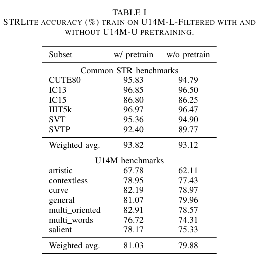

<div align="center">

# STRLite: MAE-Pretrained Scene Text Recognition

Tiny MAE pretraining + autoregressive decoder fine-tuning for scene text recognition (STR), using standard LMDB datasets and Hydra configs.

</div>

## Contents

- [1. Overview](#1-overview)
- [2. Environment Setup](#2-environment-setup)
- [3. Dataset Format](#3-dataset-format)
- [4. Training Pipeline](#4-training-pipeline)
- [5. Quick Start](#5-quick-start)
- [6. Experiments](#6-experiments)
  - [6.1 Model Architecture](#61-model-architecture)
  - [6.2 Results](#62-results)
- [7. Output Files](#7-output-files)
- [8. Project Structure](#8-project-structure)

## 1. Overview

This project trains STR in two stages:

1. MAE pretraining (image reconstruction, no text labels required).
2. Fine-tuning with an autoregressive Transformer decoder (teacher forcing with labeled text).

Default setup:

- Input image size: `32 x 128`
- Patch size: `4 x 8` (`8 x 16 = 128` image tokens)
- Encoder: Tiny ViT (`depth=12`, `embed_dim=192`, `heads=12`)
- MAE decoder (pretrain only): `depth=1`, `embed_dim=96`, `heads=3`
- Fine-tune decoder: autoregressive Transformer decoder
- Inference: greedy decode with per-layer cache
- Charset dictionary: `util/EN_symbol_dict.txt`

## 2. Environment Setup

Requirements:

- Python 3.10+ (recommended)
- CUDA GPU (recommended for training)

Install dependencies:

```bash
pip install -r requirements.txt
```

## 3. Dataset Format

Each LMDB should include:

- `num-samples`
- `image-000000001`, `image-000000002`, ...
- `label-000000001`, `label-000000002`, ... (required for fine-tuning and evaluation)

Path behavior:

- `data_path`, `train_data_path`, `val_data_path`, `test_data_path` can be one path or a list of paths.
- Loader recursively finds any nested folder containing `data.mdb`.

## 4. Training Pipeline

1. Pretrain with MAE: `main_pretrain.py`
2. Fine-tune AR decoder: `main_finetune.py`
3. Evaluate checkpoint:
   - quick eval via `main_finetune.py eval=true` (uses `val_data_path`)
   - standalone eval via `eval.py` (uses `test_data_path`)

## 5. Quick Start

### 5.1 MAE Pretraining

```bash
python main_pretrain.py data_path='[/path/to/lmdb_pretrain]'
```

Distributed example:

```bash
torchrun --nproc_per_node=8 main_pretrain.py \
  data_path='[/path/to/lmdb_pretrain]'
```

### 5.2 Fine-tuning

```bash
python main_finetune.py \
  train_data_path='[/path/to/lmdb_train]' \
  val_data_path='[/path/to/lmdb_val]' \
  pretrained_mae=/path/to/pretrain_checkpoint.pth
```

### 5.3 Evaluation

Eval via fine-tune script (evaluates `val_data_path`):

```bash
python main_finetune.py \
  train_data_path='[/path/to/lmdb_train]' \
  val_data_path='[/path/to/lmdb_val]' \
  resume=/path/to/finetune_checkpoint.pth \
  eval=true
```

Standalone eval (recommended for benchmark reporting):

```bash
python eval.py \
  resume=/path/to/finetune_checkpoint.pth \
  test_data_path='[/path/to/lmdb_test]'
```

## 6. Experiments

### 6.1 Model Architecture

STRLite follows a two-stage design for scene text recognition:

1. **MAE pretraining** learns visual representations from unlabeled images by reconstructing masked patches.
2. **Autoregressive fine-tuning** reuses the pretrained ViT encoder and trains a Transformer decoder with teacher forcing to predict text tokens.

```html
<div align="center">
  
</div>
```

### 6.2 Results

Results of STRLite Accuracy with or without MAE pretraining on six common Datasets.

```html
<div align="center">
  
</div>
```

## 7. Output Files

Hydra creates timestamped output folders.

Common artifacts:

- checkpoints: `checkpoint-*.pth`, `checkpoint-last.pth`
- training logs: `log.txt`
- tensorboard logs
- standalone eval report: `eval_results.json`

## 8. Project Structure

- `main_pretrain.py`: pretraining entry
- `engine_pretrain.py`: pretraining epoch loop
- `main_finetune.py`: fine-tuning entry
- `engine_finetune.py`: fine-tune and evaluation loops
- `eval.py`: standalone benchmark evaluation
- `conf/pretrain.yaml`: pretraining config
- `conf/finetune.yaml`: fine-tuning config
- `conf/eval.yaml`: eval config
- `src/models/mae_vit_tiny_str.py`: MAE model
- `src/models/vit_str_ar.py`: AR STR model
- `src/data/lmdb_dataset.py`: dataset and collate
- `src/tokenizer.py`: BOS/EOS/PAD tokenizer
- `src/metrics/rec_metric.py`: metrics (`acc`, `acc_real`, `acc_lower`)
