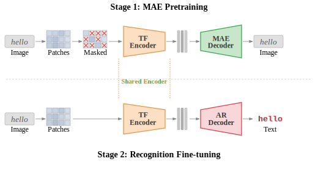

<div align="center">

# STRLite: MAE-Pretrained Scene Text Recognition

STRLite trains scene text recognition models in two stages: MAE pretraining for visual representation learning, followed by autoregressive decoder fine-tuning for text generation.

<div align="center">
  
</div>

</div>

## ✨ Key Features

| Feature | Description |
| :--- | :--- |
| 🪶 **Ultra-Lightweight** | Requires only **6M parameters**, making it highly cost-effective for domain-specific adaptation and real-world deployment. |
| 🔄 **Two-Stage Pipeline** | **MAE pretraining** on unlabeled images, followed by **autoregressive fine-tuning** on labeled text images. |
| 🗄️ **Standard LMDB Support** | Uses common LMDB keys (`num-samples`, `image-*`, `label-*`) with automatic recursive dataset discovery. |
| ⚙️ **Hydra-Driven Workflow** | Fully config-driven execution for pretraining, fine-tuning, and standalone evaluation. |
| 📊 **Robust Evaluation** | Comprehensive reporting including `acc`, `acc_real`, and `acc_lower` with a detailed per-benchmark breakdown. |
| ⚡ **Efficient Inference** | Implements greedy autoregressive decoding with **per-layer key-value (KV) caching** to accelerate inference. |

## 1. Overview

Core code paths:

- Pretraining entry: `main_pretrain.py`
- Fine-tuning entry: `main_finetune.py`
- Standalone evaluation: `eval.py`

## 2. Environment Setup

See [INSTALLATION.md](INSTALLATION.md).

## 3. Dataset Format

See [DATASET.md](DATASET.md).

## 4. Quick Start

The end-to-end workflow is: pretrain a MAE encoder, fine-tune with an autoregressive decoder, then evaluate a checkpoint on validation or test benchmarks.

### 4.1 MAE Pretraining

```bash
python main_pretrain.py data_path='[/path/to/lmdb_pretrain]'
```

Distributed example:

```bash
torchrun --nproc_per_node=8 main_pretrain.py \
  data_path='[/path/to/lmdb_pretrain]'
```

### 4.2 Fine-tuning

```bash
python main_finetune.py \
  train_data_path='[/path/to/lmdb_train]' \
  val_data_path='[/path/to/lmdb_val]' \
  pretrained_mae=/path/to/pretrain_checkpoint.pth
```

### 4.3 Evaluation

Eval via fine-tune script (evaluates `val_data_path`):

```bash
python main_finetune.py \
  train_data_path='[/path/to/lmdb_train]' \
  val_data_path='[/path/to/lmdb_val]' \
  resume=/path/to/finetune_checkpoint.pth \
  eval=true
```

Standalone eval (recommended for benchmark reporting):

```bash
python eval.py \
  resume=/path/to/finetune_checkpoint.pth \
  test_data_path='[/path/to/lmdb_test]'
```

## 5. Experiments

### 5.1. Pre-training 
- ViT-Tiny pretrained on U14M-U.

| Variants | Embedding | Depth | Heads | Parameters |
| -------- | --------- | ----- | ----- | ---------- |
| ViT-Tiny | 192       | 12    | 12    | 6M         |

- If you want to pre-train the ViT backbone on your own dataset, check [pre-training](pretrain.md)


### 5.2. Fine-tuning 
- STRLite finetuned on U14M-L-Filtered.

| Variants | Acc on Common Benchmarks | Acc on U14M-Benchmarks |
| -------- | ------------------------ | ---------------------- |
| STRLite  | 93.82                    | 81.03                  |

- If you want to fine-tune STRLite on your own dataset, check [fine-tuning](finetune.md)

### 5.3 Results

Results of STRLite Accuracy (%) with or without MAE pretraining on six common Datasets.

**Common STR benchmarks**

| Subset | w/ pretrain | w/o pretrain |
| ------ | ----------- | ------------ |
| CUTE80 | 95.83 | 94.79 |
| IC13 | 96.85 | 96.50 |
| IC15 | 86.80 | 86.25 |
| IIIT5k | 96.97 | 96.47 |
| SVT | 95.36 | 94.90 |
| SVTP | 92.40 | 89.77 |
| **Weighted avg.** | **93.82** | **93.12** |

**U14M benchmarks**

| Subset | w/ pretrain | w/o pretrain |
| ------ | ----------- | ------------ |
| artistic | 67.78 | 62.11 |
| contextless | 78.95 | 77.43 |
| curve | 82.19 | 78.97 |
| general | 81.07 | 79.96 |
| multi oriented | 82.91 | 78.57 |
| multi words | 76.72 | 74.31 |
| salient | 78.17 | 75.33 |
| **Weighted avg.** | **81.03** | **79.88** |
